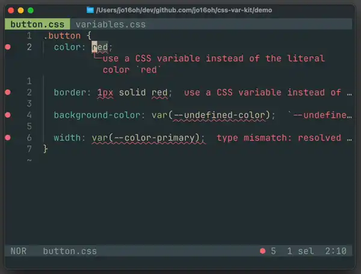

<p align="center">
  <picture>
    <source media="(prefers-color-scheme: dark)" srcset="assets/cvk-banner-dark.png">
    <source media="(prefers-color-scheme: light)" srcset="assets/cvk-banner-light.png">
    
  </picture>
</p>

# css-var-kit

A simple, lightweight toolkit to help build design systems using CSS variables.

[](https://www.npmjs.com/package/css-var-kit)
[](https://crates.io/crates/css-var-kit)

## Demo



## Installation ⬇️

```sh
npm install -D css-var-kit
```

Or install via Cargo:

```sh
cargo install css-var-kit
```

## Commands 🧰

### `cvk lint`

Lints CSS variables and their usage. Detects undefined variables, type mismatches, inconsistent definitions, and enforces variable usage for design tokens.

[More Documentation](docs/linter.md)

### `cvk lsp`

A language server for CSS variables that offers type-aware variable completion and lint warnings.

#### Supported Features✨

- Show diagnostics from `cvk lint`
- Type-aware variable completion
- Rename variable
- Go to defintition

#### Editor Integration

Helix:

```helix
[language-server.css-var-kit]
command = "cvk"
args = ["lsp"]

[[language]]
name = "css"
language-servers = ["css-var-kit"]
```

Neovim:

```
⚠️WIP (contributions are welcome😉)⚠️
```

## Planned Features 📝

- `cvk prune` command
  - Strips unused CSS variables from the final build output.
- Editor extensions
  - VsCode, Zed...
